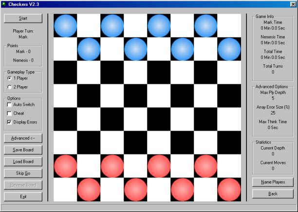



## AI Checkers

### Description

This code is an artificial intelligence checkers program and is virtually impossible to beat (Runs at depth of 5 or 6 on a P2 266). This code has won 2 code of the month awards both on this website and A1VBCode.
 
### More Info
 
Uses a very simple idea but the code is quite complicated but nothing the intermediate programmer can't handle!

             |
---                |---
**Submitted On**   |2000-05-29 09:03:24
**By**             |[Viper](https://github.com/Planet-Source-Code/PSCIndex/blob/master/ByAuthor/viper.md)
**Level**          |Intermediate
**User Rating**    |4.5 (54 globes from 12 users)
**Compatibility**  |VB 4\.0 \(32\-bit\), VB 5\.0, VB 6\.0
**Category**       |[Games](https://github.com/Planet-Source-Code/PSCIndex/blob/master/ByCategory/games__1-38.md)
**World**          |[Visual Basic](https://github.com/Planet-Source-Code/PSCIndex/blob/master/ByWorld/visual-basic.md)
**Archive File**   |[CODE\_UPLOAD6460652000\.zip](https://github.com/Planet-Source-Code/viper-ai-checkers__1-8330/archive/master.zip)

